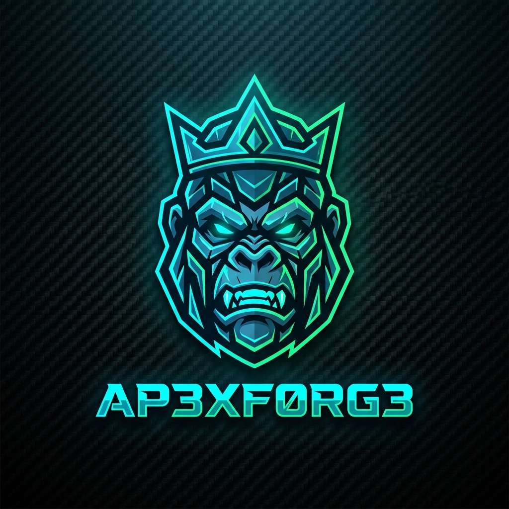

<p align="center">
  
</p>

<h1 align="center">Ap3xF0rg3 — Become the Apex Predator</h1>

<p align="center">
  <strong>From Primate Strength to True Apex Predator.</strong><br>
  Personalized progressive workout splits, zero-paywall barbell plate loaders, 1RM calculators, and smart AI gym coaching.
</p>

<p align="center">
  
  
  
  
  
</p>

---

## 🦍 The Ap3xF0rg3 Concept

> *"Humans start in the gym thinking they are strong like a chimpanzee. Then they lift heavier and become like a Silverback Gorilla 🦍—massive, but still vulnerable to lions in the savannah. Forge your strength, master progressive overload, and ascend to the **TRUE APEX PREDATOR 👑** at the top of the food chain, beaten by no animal in the kingdom."*

---

## ⚡ Quick Start

```bash
# 1. Install dependencies
npm install

# 2. Start development server
npm run dev
```

Open **`http://localhost:3000`** in your browser.

---

## 🎯 Features That Beat Commercial Paid Apps

Most gym tracking apps (Hevy, Strong, Fitbod) hide essential workout tools behind a $10/month subscription paywall. **Ap3xF0rg3 gives them all to you for 100% free:**

### 1. 🏋️ Zero-Paywall Barbell Plate Loader & 1RM Calculator
- **Visual Barbell Plate Loader**: Enter any target weight (e.g. 80 kg, 100 kg, 140 kg) and choose your bar (20kg Olympic, 15kg Technique, or 10kg EZ-bar). Visually renders the color-coded Olympic bumper plates (`25kg Red`, `20kg Blue`, `15kg Yellow`, `10kg Green`, `5kg White`, `2.5kg Black`, `1.25kg Chrome`) per side with a checklist.
- **1-Rep Max (1RM) Estimator**: Calculates your 1RM from any working set using validated Epley & Brzycki formulas.
- **Dynamic Percentage Table**: Generates working loads for 95%, 90%, 85%, 80%, 75%, 70%, and 65% with target rep guidelines.

### 2. 👑 The Apex Evolution Tonnage Engine
- Computes live session tonnage lifted in real-time (`Weight × Reps × Sets`).
- Evolves your rank dynamically with interactive badges and funny lore:
  - 🐒 **Rank I: Chimp Cadet** (0 – 1,500 kg moved)
  - 🦍 **Rank II: Silverback Gorilla** (1,500 – 4,000 kg moved)
  - 🐅 **Rank III: Primal Hunter** (4,000 – 7,500 kg moved)
  - 👑 **Rank IV: True Apex Predator** (7,500+ kg moved)

### 3. ⏱️ Primal Fanfare Rest Stopwatch
- Tap any completed set to automatically launch the Rest Stopwatch.
- **Gorilla Hype Mode**: Plays a Web Audio 4-note ascending victory fanfare and flashes motivational gym battle cries when the timer hits zero.
- Presets for 60s, 90s, 120s, and +/- 15s quick-taps.

### 4. 🤖 100% Free Gemini LLM AI Coach
- Direct integration with **Google Gemini 1.5/2.0 Flash** via Google AI Studio (`aistudio.google.com`) — completely free (15 RPM, 1,500 requests/day, zero credit card needed).
- Analyzes session volume, mechanical tension targets, smart exercise swaps, and pre-workout nutrition for your scheduled gym time.
- Intelligent offline fallback coach works out-of-the-box with zero API keys.

### 5. 🔗 Instant Link Sharing (No Login Required)
- Share your exact workout split and today's session with friends via a single URL (`?share=...`).
- Friends can open the link in any browser on their phone and immediately train with your plan.
- Includes pre-built **Supabase Google OAuth** configuration and SQL migration scripts for full cloud synchronization.

---

## 🚀 1-Click Free Deployment on Vercel

1. Push this repository to your GitHub account:
   ```bash
   git push origin main
   ```
2. Go to [vercel.com/new](https://vercel.com/new) and import the repository.
3. Framework Preset: **Vite**. Build command: `npm run build`.
4. (Optional) Add Environment Variables:
   - `VITE_GEMINI_API_KEY`: Your free Gemini API key
   - `VITE_SUPABASE_URL`: Your Supabase URL
   - `VITE_SUPABASE_ANON_KEY`: Your Supabase anon key
5. Click **Deploy**. Your app is live with free global SSL!

---

## 🛡️ Security & Privacy

- **Local First**: All workout data, weights, and profile settings are stored securely in browser `localStorage`.
- **Zero Tracker Bloat**: No third-party ad networks or data brokers.
- **Sanitized URL Parser**: URL import logic runs with safe JSON parsing and input sanitization to guard against malformed parameters.

---

## 📜 License

MIT License — Free to use, share, and fork. Forge yourself! 🦍👑
